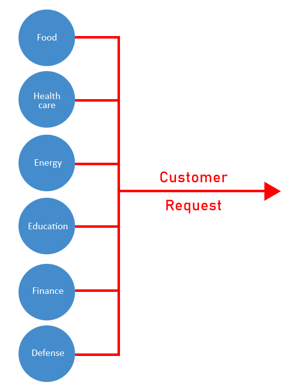
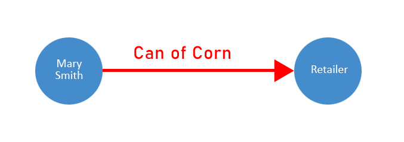
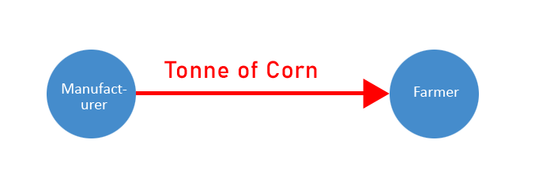

# Eleutherios

Eleutherios (https://eleutherios.org.nz) is a global cooperative forum or two-way communications network that enables service providers (people or business) to cooperate or serve one another online.



It does this by decoupling or scaling the customer request, forum or conversation, that the vertical domain or service layer is having with one another.



Such as an individual buying a can of corn from a retailer.



Or a manufacturer requesting a ton of corn from a farmer.


Unfortunately this way of serving customer requests doesn't scale or the request can only go in one direction.


Eleutherios changes this behavior by decoupling the customer request layer and turning it into a service or conversation, that can go in both directions.

Now, if the Farmer needs to be a part of the conversation about a can of corn, they can join that conversation.  Likewise if the retailer needs to join the conversation about a Tonne of corn, then they can be invited to join that conversation.

Eleutherios provides basic features, but will quickly evolve to include more SAAS, PAAS features such as AI, analytics + reporting.

#### Features:

* Tags for filtering forums or services (search)
* Forum in forum (scalability)
* Blocking to prevent unwanted services or users from serving in forums, they have been asked not to serve in or for requesting services, they have been asked not to request (resilience)
* Service ratings/reviews (trust)
* B2B Payments (accountability)

Eleutherios is built with Node.js, Firestore and Angular.

# Installation and Setup

### 0. Prerequisites

```bash
i.    a new or existing firebase application with at least a google, facebook or email passwordless provider
ii.   node.js (https://nodejs.org/en/)
iii.  firebase cli (npm install -g firebase-tools)
iv.   angular cli (npm install -g @angular/cli)
```

### 1. Cloning Eleutherios

The easiest way to get Eleutherios up and running is to clone it to your machine.

```bash
i.    git clone https://github.com/aletheon/eleutherios-website.git eleutherios-website
ii.   run npm install to install dependencies
iii.  create a new folder in your src folder called environments to hold your environment (environment.prod.ts and environment.ts) variables:
```

```bash
export const environment = {
  production: true | false,
  firebase: {
    apiKey: "xxxxxxxxxxxxxxxxxxxxxxxxxxxxxxxxxxxxxx",
    authDomain: "xxxxxxxxxxxxxxxxxxxxxxxxxxxxxxxxxxxxxx",
    databaseURL: "xxxxxxxxxxxxxxxxxxxxxxxxxxxxxxxxxxxxxx",
    projectId: "xxxxxxxxxxxxxxxxxxxxxxxxxxxxxxxxxxxxxx",
    storageBucket: "xxxxxxxxxxxxxxxxxxxxxxxxxxxxxxxxxxxxxx",
    messagingSenderId: "xxxxxxxxxxxxxxxxxxxxxxxxxxxxxxxxxxxxxx",
    appId: "xxxxxxxxxxxxx",
    measurementId: "xxxxxxxxxxxxx"
  },
  googleTagManagerId: "xxxxxxxxxxxxx",
  stripeTestKey: "xxxxxxxxxxxxxxxxxxxxxxxxxxxxxxxxxxxxxx",
  url: "xxxxxxxxxxxxxxxxxxxxxxxxxxxxxxxxxxxxxx"
};
```
```bash
iv.   firebase login
v.    firebase init
```

### 2. Login to firebase and deploy functions folder

Eleutherios uses functions to modify the behavior of the system and its data before or after it is created, updated or deleted in the system.  If you are planning on doing work on the backend API, then you should install firebase functions to help you test your work before committing it.

```bash
i.   cd functions
ii.  npm install
iii. firebase deploy --only functions
```

### 3. Setup firebase

It's important to setup your firebase backend to work with the source code.

```bash
i.    enable firebase authentication (email/password, google, facebook)
ii.   create a totals table in firebase not firestore, with the following default structure:
        totals
          forum
            count: 0
          service
            count: 0
          user
            count: 0
```

### 4. Run Eleutherios

Once you have setup Eleutherios you can run it on your local server.

If you have any difficulties setting Eleutherios up then please contact me so I can help you.

```bash
i.    ng serve
ii.   go to http://localhost:4200/
```

### 5. Contribute

Help fix bugs or resolve issues.
https://github.com/aletheon/eleutherios-website/issues
