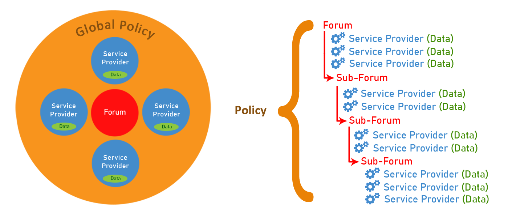
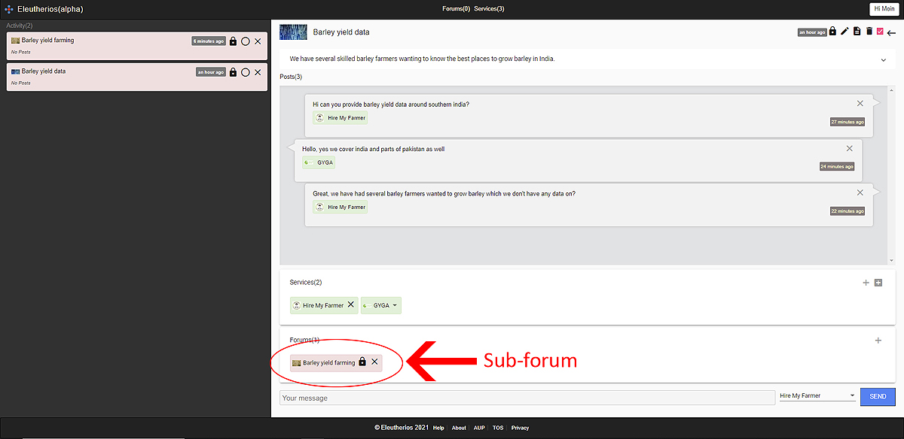

# Eleutherios

Eleutherios (https://eleutherios.org.nz) is a global cooperative forum that enables people or service providers to cooperate with one another, through the same forum or network.

Service providers can scale their forum and share in the policy making process.



#### Advantages

- Creates partnerships (Service providers can create and share policies with one another)
- Creates new capacity (Service providers can scale their forum or network)
- Share data (Service providers can share their data or information with one another)
- Improves livelihoods or equality (Service providers can create new businesses or business models)
- Reduces waste, carbon emissions and inefficiences (Service providers can manage the entire value chain from supplier to consumer)


In the current sociopolitical or economic system, service providers are unable to scale their customer request or network.

The customer request or network is linear or a one-to-one relationship between two service providers.

#### Disadvantages

- Prevents partnerships (Service providers are unable to create or share policies)
- Prevents new capacity (Service providers are unable to scale their request or network)
- Unable to share data (Service providers are unable to share their data or information with one another)
- Impairs livelihoods or inequality (Service providers are unable to create new businesses or business models)
- Increases waste, carbon emissions and inefficiences (Service providers are unable to manage the entire value chain from supplier to consumer)

#### Prototype


Priska can register with the website and create a service. She can give it a price, title, description, website url and tags.


End users can search for services such as Priska’s and request her service by clicking on the plus symbol to create a forum.


In this example, Moin wants access to barley yield data from Priska and has added himself (Hire My Farmer) and Priska (Gyga) to the forum.


Service providers communicate with one another by sending text messages through the forum. They can click the plus button on the services tab to keep adding more services to the conversation or click the sub-forum button to create a feedback loop to separate the concerns of each request.


Separating the concerns of each request is important, because it enables service providers to focus on the data or service that they are able to provide. In this case Moin wants to separate the concerns of managing Barley yield data away from Barley yield farming and delegates the responsibility to another service provider, John (Barley Farming Ltd) to manage. In our MVP, service providers who create forums, don’t have to be the ones that manage it. Any service provider can manage the forum, depending on whether they can provide the service or not.


At the parent level sub-forums show up in a list and can be navigated to by clicking on them.


At the child level the parent shows up as a breadcrumb, where the service provider can navigate their way back up the tree or network.

#### Current features:

- Search for forums or service providers
- Scalable forum or network
- Blocking to prevent unwanted behavior within forums
- Rating and reviewing service providers
- B2B Payments

#### Future features:

- Create and share policies
- File sharing
- Bookkeeping
- B2B/Cloud services (i.e. compute, analytics, database, storage, AI)
- Plugins (e.g. video, audio, VR)

Eleutherios is built with Node.js, Firestore and Angular.

# Installation and Setup

### 0. Prerequisites

```bash
i.    a new or existing firebase application with at least a google, facebook or email passwordless provider
ii.   node.js (https://nodejs.org/en/)
iii.  firebase cli (npm install -g firebase-tools)
iv.   angular cli (npm install -g @angular/cli)
```

### 1. Cloning Eleutherios

The easiest way to get Eleutherios up and running is to clone it to your machine.

```bash
i.    git clone https://github.com/aletheon/eleutherios-website.git eleutherios-website
ii.   run npm install to install dependencies
iii.  create a new folder in your src folder called environments to hold your environment (environment.prod.ts and environment.ts) variables:
```

```bash
export const environment = {
  production: true | false,
  firebase: {
    apiKey: "xxxxxxxxxxxxxxxxxxxxxxxxxxxxxxxxxxxxxx",
    authDomain: "xxxxxxxxxxxxxxxxxxxxxxxxxxxxxxxxxxxxxx",
    databaseURL: "xxxxxxxxxxxxxxxxxxxxxxxxxxxxxxxxxxxxxx",
    projectId: "xxxxxxxxxxxxxxxxxxxxxxxxxxxxxxxxxxxxxx",
    storageBucket: "xxxxxxxxxxxxxxxxxxxxxxxxxxxxxxxxxxxxxx",
    messagingSenderId: "xxxxxxxxxxxxxxxxxxxxxxxxxxxxxxxxxxxxxx",
    appId: "xxxxxxxxxxxxx",
    measurementId: "xxxxxxxxxxxxx"
  },
  googleTagManagerId: "xxxxxxxxxxxxx",
  stripeTestKey: "xxxxxxxxxxxxxxxxxxxxxxxxxxxxxxxxxxxxxx",
  url: "xxxxxxxxxxxxxxxxxxxxxxxxxxxxxxxxxxxxxx"
};
```

```bash
iv.   firebase login
v.    firebase init
```

### 2. Login to firebase and deploy functions folder

Eleutherios uses functions to modify the behavior of the system and its data before or after it is created, updated or deleted in the system. If you are planning on doing work on the backend API, then you should install firebase functions to help you test your work before committing it.

```bash
i.   cd functions
ii.  npm install
iii. firebase deploy --only functions
```

### 3. Setup firebase

It's important to setup your firebase backend to work with the source code.

```bash
i.    enable firebase authentication (email/password, google, facebook)
ii.   create a totals table in firebase not firestore, with the following default structure:
        totals
          forum
            count: 0
          service
            count: 0
          user
            count: 0
```

### 4. Run Eleutherios

Once you have setup Eleutherios you can run it on your local server.

If you have any difficulties setting Eleutherios up then please contact me so I can help you.

```bash
i.    ng serve
ii.   go to http://localhost:4200/
```

### 5. Contribute

Help fix bugs or resolve issues.
https://github.com/aletheon/eleutherios-website/issues

Make a donation to the Eleutherios open source project. https://opencollective.com/eleutherios
